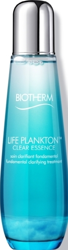
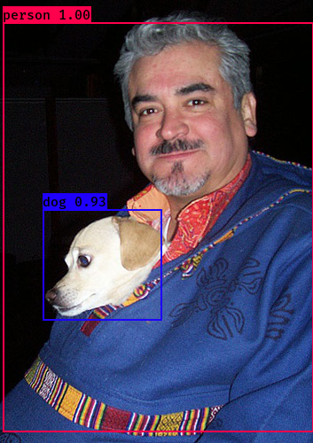
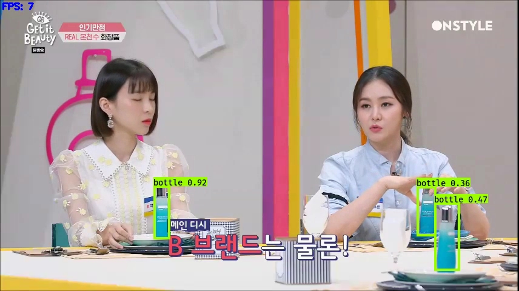

# CosmeticDetectionYolo3

## Introduction

A Cosmetic detector using YOLOv3 (Tensorflow backend) for cosmetic detection (ref: [qqwweee/keras-yolo3](https://github.com/qqwweee/keras-yolo3))

## Requirement

### Environment
- Python 3.6.8

- Keras 2.2.4

- Tensorflow 1.6.0

- CUDA 9.0

- cudnn 7.0

- opencv 3.4.0

### Libraries
- colormath

- Pillow

- numpy

- Keras

- opencv-python

- imgaug

- matplotlib

- omnis 0.0.8.4

## Test data

Test data is under 'images/'



## How to use:

### 1) Get the model

Step 1: Download the project:
```
git clone https://github.com/2013-11390/cosmeticDetectionYolo3.git
```

Step 2: Download YOLOv3 weights from [YOLO website](http://pjreddie.com/darknet/yolo/) or [yolov3.weights](https://drive.google.com/uc?id=1owAyOwfpwxpbs0BLWPkwT0srRUTpFHIn&export=download).

Step 3: Convert the Darknet YOLO model to a Keras model 
```
python convert.py yolov3.cfg yolov3.weights model_data/yolo.h5	# to get yolo.h5(model)
```

**OR** download the model [yolo.h5](https://drive.google.com/uc?export=download&confirm=8R0l&id=1Dd-uUhhXvosXiIIZM8tiXoZyENJxIY4u) to *model_data/* directory directly.

### 2) Test the model on coco dataset(original yolo model is trained on coco dataset)
Run YOLO detecion.
```
python yolo_video.py --model_path model_data/yolo.h5 --classes_path model_data/coco_classes.txt --image
```



### 3) Resnet 50 classification model
Step 1: Put cosmetic image in images folder by name 'cosmetic_dataset'
Below 'cosmetic_dataset' you have to make directories divided by class names
cosmetic_dataset
  | outputFalse
  | outputTure


Step 2: Train resnet 50 classification model
```
python trainResnet.py
```
Then you will get ImageClassification.h5 file in your folder

Step 3: Classify image by trained data
```
python ClassificationByResnet.py filepath
```


## Cosmetic detection result




